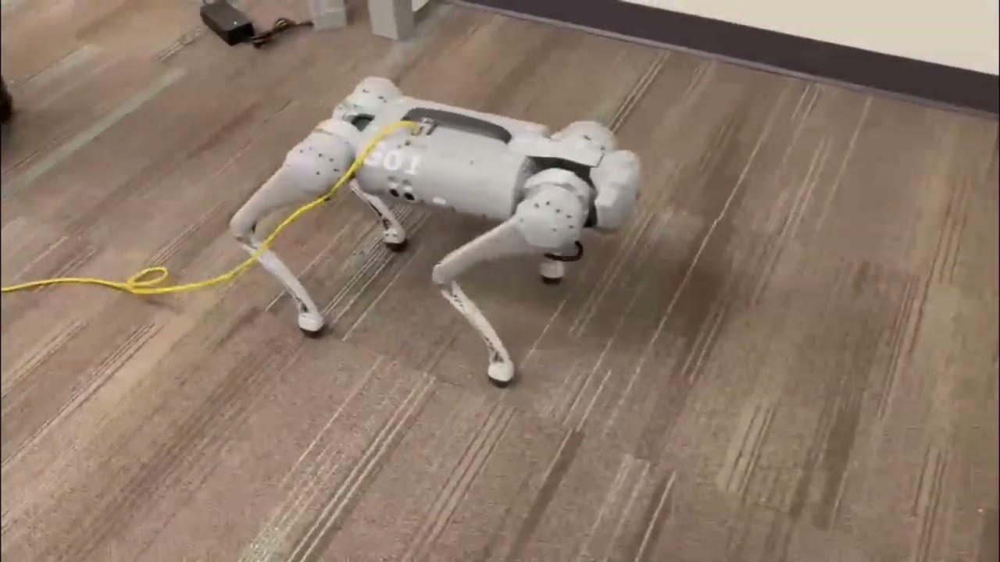
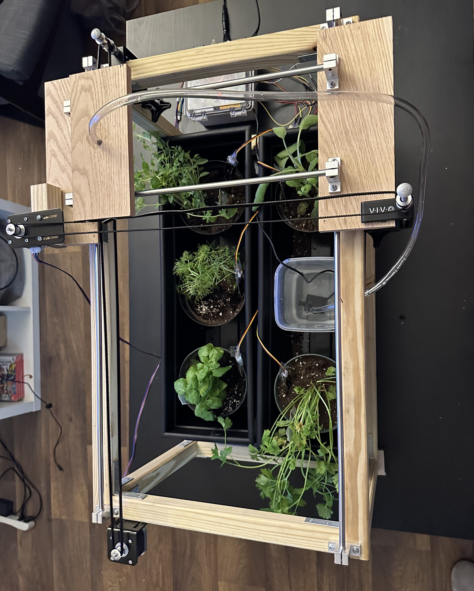

# Marcus Fernandez Decastro's Projects

---

## R&D Robotics Internship Project

[Watch the video](IMG_1180.mov)

---

## Robotics Research, UCF Robotics Lab

[Watch the video](https://www.youtube.com/watch?v=E8IlQSd_oBM)

---

## 4DOF Robotic Arm and VR Integration

[Watch the video](https://www.canva.com/design/DAGDwvomoNQ/nAjIXmFpKGtzXOnixNzMCQ/view?utm_content=DAGDwvomoNQ&utm_campaign=designshare&utm_medium=link&utm_source=editor)

---

## Smart Herb Garden

[Watch the video](https://www.ece.ucf.edu/seniordesign/su2022fa2022/g24/docs/FinalDemo.mp4)
